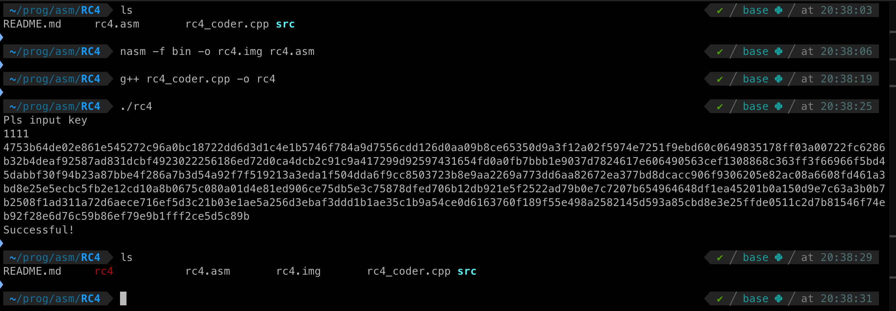
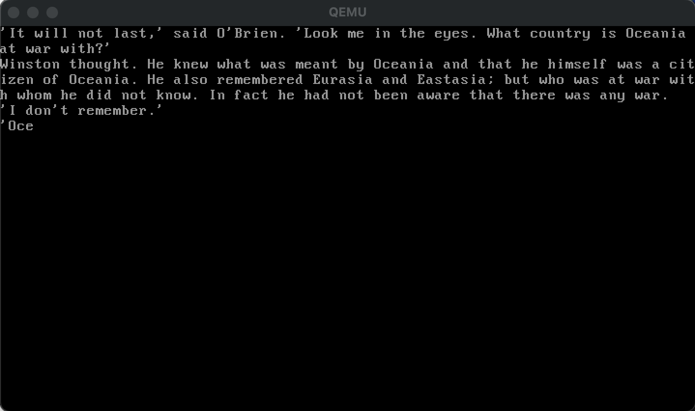

# Purpose of the programme

Originally at my university there was a competition to decipher text using RC4 and output the maximum number of characters, here is the full condition

Write a loader that displays a portion of text from a given piece of work.
Conditions:

1. The total size of the loader including the text must not exceed one standard sector.
2. The output text segment must exactly match the identical segment from the given text. 3.
3. The segment must be placed in the body of the loader in encrypted form. Encryption algorithm RC4. Password length is at least 4 characters. The password is used as a key.
4. The password must be entered by the user from the keyboard (it is allowed not to specify the prompt for entry). Verification of the correctness of the entered password is carried out by the user based on the decryption results.

For this purpose we have written a code that encrypts the text and fills the binary file and a code in ASM that decrypts it and outputs it to the console

## How to use it?

- nasm -f bin -o rc4.img rc4.asm
- g++ rc4_coder.cpp -o rc4
- ./rc4

The result of these commands will be:

- qemu-system-x86_64 -fda rc4.img

In the open menu you need to enter the password and that's it

The result of this command is:

